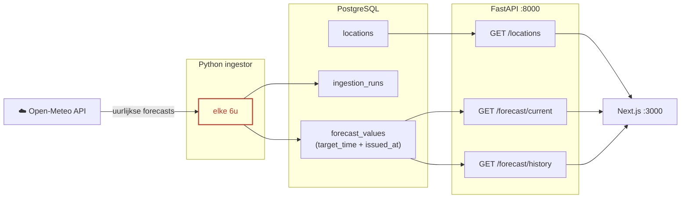

## Probleemstelling & Scope

Deze software neemt Belgische weersvoorspellingen op uit Meteo-open API en plaatst ze in een database van PostgresSQL. 
Deze database moet vervolgens kunnen communiceren met een fastapi backend, om de data in een next.js frontend te kunnen displayen.

## Aannames en simplificaties
* Vaste set Belgische steden
* Geen authenticatie vereist
* Enkel voorspellingen
* 6-uurlijkse polling in plaats van uurlijks

## Architectuur & Tech Stack

* FastAPI 
* PostgreSQL 
* Next.js + TypeScript
* Docker Compose
* Open-Meteo 

## Ontwikkelingsfasen

### Fase 1 — Datapipeline
Eerste prioriteit: forecastdata betrouwbaar uitlezen van Open-Meteo.

Gebouwd in een test-omgeving om de API-respons te kunnen bekijken en manipuleren om in een database op te slaan.
Van zodra de ingestielogica er was, het opnemen van de data idempotent maken. Hierna naar de API-laag gegaan.

### Fase 2 — API + Docker
Data beschikbaar gesteld via drie FastAPI-endpoints. 
De volledige stack in Docker Compose bedraad met expliciete health checks: `backend` wacht
tot Postgres gezond is én de `migrate` service met exitcode 0 afsluit
voor hij start. Bewuste keuze — de opdracht vermeldde expliciet dat de
Docker-opstelling getest zou worden op een verse clone.

### Fase 3 — Dashboard
Next.js dashboard gebouwd met locatiekiezer en forecasttabel. 
De tijd raakte op voor de UI volledig afgewerkt kon worden. 

## Afwegingen 

Hoewel dit een vereiste was: geen scheduled ingest module, `run_ingestion_cycle` is een gewone functie. Deze wordt aangesloten op cron of APScheduler. 

Geen UI-afwerking: de interface is functioneel maar esthetisch niet verantwoord... Gezien de tijd besteed aan de Docker-opstelling en pipeline moest ik hier in .

Geen revisiegeschiedenisweergave in het dashboard: de `/forecast/history` endpoint bestaat en werkt. De frontend-weergave
werd weggelaten wegens tijdsgebrek. (deze endpoint werd niet door mezelf bepaald, maar eerder door Claude vermeld, vond het wel interessant om toe te voegen)

Geen `as-of` endpoint: ontworpen in het datamodel, niet geïmplementeerd in de API.

## Toekomstige Roadmap

Als ik meer tijd zou hebben, zou ik het hieraan besteden:

- Een mooiere (leesbaardere) UI.

- Energie-inzichten bovenop weerdata: het weer beïnvloedt energiegebruik aanzienlijk. 
Bijvoorbeeld bij een zonnige voorspelling → optimaal venster om batterijen op te laden. Temperatuurschommelingen → vraagvoorspelling. Ik denk dat dit een meerwaarde is die het simpele weersvoorspellingsmodel koppelt aan de missie van Ella energy.

- Revisiegeschiedenisweergave in het dashboard toevoegen: de data en het endpoint bestaan beide

- Geplande ingestie: `run_ingestion_cycle` aansluiten op een
scheduler zodat de pipeline elke 6 uur onbeheerd loopt.