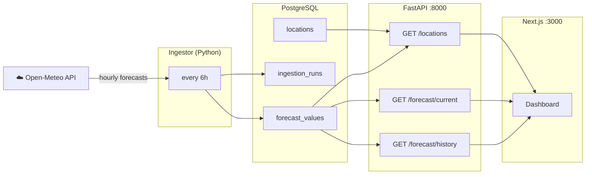

#doel

Deze software neemt Belgische weersvoorspellingen op uit Meteo-open API en plaatst ze in een database van PostgresSQL. 
Deze database moet vervolgens kunnen communiceren met een fastapi backend, om de data in een next.js frontend te kunnen displayen.

#Architectuur

